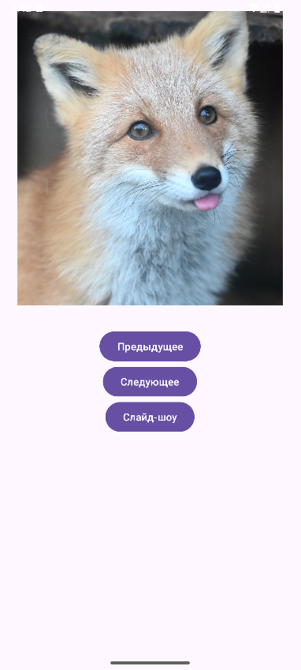
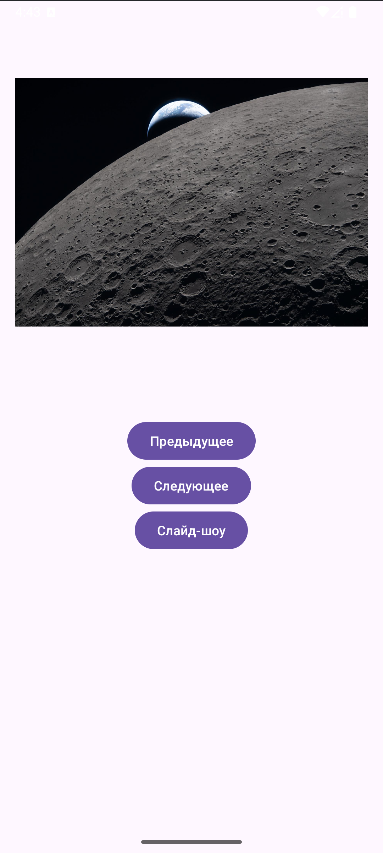
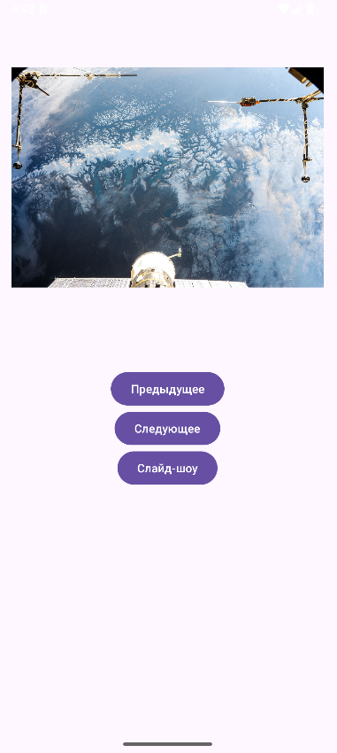

<div align="center">

# Отчёт

</div>

<div align="center">

## Практическая работа №8

</div>

<div align="center">

## Ресурсы. Работа с медиа-элементами

</div>

**Выполнил:** Деревянко Артём Владимирович<br>
**Курс:** 2<br>
**Группа:** ИНС-б-о-24-2<br>
**Направление:** 09.03.02 Информационные системы и технологии<br>
**Проверил:** Потапов Иван Романович

---

### Цель работы
Изучить способы добавления и отображения графических ресурсов, научиться работать с аудио- и видеофайлами в Android-приложениях, освоить управление воспроизведением медиа-контента.

### Ход работы
#### Задание 1: Подготовка ресурсов
1. Был открыт Android Studio и создан новый проект с шаблоном **Empty Views Activity**. Проекту дано имя `MediaLab`.
2. Создана папка `res/raw`.
3. Подготовлены медиафайлы:
- Найдены 3 изображения, которые впоследствие были скопированы в папку `res/drawable`.
- Найден короткий аудиофайл в формате MP3 и скопирован в папку `res/raw`. Переименован в `audio_sample`.
- Найден короткий видеофайл в формате MP4 и скопирован в папку `res/raw`. Переименован в `video_sample`.

#### Задание 2: Слайд-шоу из изображений
1. В файле `activity_main.xml` создайн интерфейс с `ImageView` и тремя кнопками: "Предыдущее", "Следующее", "Слайд-шоу".
2. В `MainActivity.java` реализуйте логику переключения изображений (используйте массив ресурсов drawable). Для слайд-шоу используйте `Timer`, меняющий изображение каждые 2 секунды.
##### `activity_main.xml`
```xml
<?xml version="1.0" encoding="utf-8"?>
<LinearLayout xmlns:android="http://schemas.android.com/apk/res/android"
    android:layout_width="match_parent"
    android:layout_height="match_parent"
    android:orientation="vertical"
    android:gravity="center_horizontal"
    android:padding="16dp">

    <Space
        android:layout_width="wrap_content"
        android:layout_height="10dp"/>

    <ImageView
        android:id="@+id/imageView"
        android:layout_width="400dp"
        android:layout_height="400dp"
        android:src="@drawable/image_1"
        android:layout_marginBottom="32dp"/>

    <LinearLayout
        android:layout_width="wrap_content"
        android:layout_height="wrap_content"
        android:orientation="horizontal">
        <Button
            android:id="@+id/btnPrev"
            android:layout_width="wrap_content"
            android:layout_height="wrap_content"
            android:text="Предыдущее"/>

        <Button
            android:id="@+id/btnNext"
            android:layout_width="wrap_content"
            android:layout_height="wrap_content"
            android:text="Следующее"/>

    </LinearLayout>

    <Button
        android:id="@+id/btnSlideshow"
        android:layout_width="wrap_content"
        android:layout_height="wrap_content"
        android:text="Слайд-шоу"/>
    
    <Space
        android:layout_width="wrap_content"
        android:layout_height="40dp"/>

    <Button
        android:id="@+id/btnVideo"
        android:layout_width="wrap_content"
        android:layout_height="wrap_content"
        android:text="Открыть видеоплеер"
        android:layout_marginTop="8dp"/>

</LinearLayout>
```
##### `MainActivity.java`
```java
package com.example.medialab;

import android.content.Intent;
import android.media.MediaPlayer;
import android.os.Bundle;
import android.os.Handler;
import android.view.View;
import android.widget.Button;
import android.widget.ImageView;
import androidx.appcompat.app.AppCompatActivity;
import java.util.Timer;
import java.util.TimerTask;

public class MainActivity extends AppCompatActivity {
    private ImageView imageView;
    private int[] images = {R.drawable.image_1, R.drawable.image_2, R.drawable.image_3};
    private int currentIndex = 0;
    private Timer slideshowTimer;
    private boolean isSlideshowRunning = false;
    public static MediaPlayer mediaPlayer;

    @Override
    protected void onCreate(Bundle savedInstanceState) {
        super.onCreate(savedInstanceState);
        setContentView(R.layout.activity_main);

        imageView = findViewById(R.id.imageView);
        Button btnPrev = findViewById(R.id.btnPrev);
        Button btnNext = findViewById(R.id.btnNext);
        Button btnSlideshow = findViewById(R.id.btnSlideshow);
        Button btnVideo = findViewById(R.id.btnVideo);

        btnPrev.setOnClickListener(v -> showPreviousImage());
        btnNext.setOnClickListener(v -> showNextImage());
        btnSlideshow.setOnClickListener(v -> toggleSlideshow());
        btnVideo.setOnClickListener(new View.OnClickListener() {
            @Override
            public void onClick(View v) {
                Intent intent = new Intent(MainActivity.this, VideoActivity.class);
                startActivity(intent);
            }
        });

        startBackgroundAudio();
    }

    private void showImage(int index) {
        if (index >= 0 && index < images.length) {
            imageView.setImageResource(images[index]);
            currentIndex = index;
        }
    }

    private void showNextImage() {
        currentIndex = (currentIndex + 1) % images.length;
        showImage(currentIndex);
    }

    private void showPreviousImage() {
        currentIndex = (currentIndex - 1 + images.length) % images.length;
        showImage(currentIndex);
    }

    private void toggleSlideshow() {
        if (isSlideshowRunning) {
            if (slideshowTimer != null) {
                slideshowTimer.cancel();
            }
            isSlideshowRunning = false;
        } else {
            slideshowTimer = new Timer();
            slideshowTimer.schedule(new TimerTask() {
                @Override
                public void run() {
                    runOnUiThread(() -> showNextImage());
                }
            }, 0, 2000); // каждые 2 секунды
            isSlideshowRunning = true;
        }
    }

    private void startBackgroundAudio() {
        mediaPlayer = MediaPlayer.create(this, R.raw.audio_sample);
        mediaPlayer.setLooping(true); // Зацикливание
        mediaPlayer.start();
    }

    // Метод для паузы (вызывается при запуске видео)
    public static void pauseBackgroundAudio() {
        if (mediaPlayer != null && mediaPlayer.isPlaying()) {
            mediaPlayer.pause();
        }
    }

    // Метод для возобновления с задержкой
    public static void resumeBackgroundAudio() {
        new Handler().postDelayed(() -> {
            if (mediaPlayer != null && !mediaPlayer.isPlaying()) {
                mediaPlayer.start();
            }
        }, 1500);
    }

    @Override
    protected void onDestroy() {
        super.onDestroy();
        if (slideshowTimer != null) {
            slideshowTimer.cancel();
        }
        if (mediaPlayer != null) {
            mediaPlayer.release();
            mediaPlayer = null;
        }
    }
}
```
<br>
<br>


#### Задание 3: Воспроизведение видео
1. Создана новая Activity `VideoActivity` с соответствующей разметкой `activity_video.xml`
2. В разметку добавлены `VideoView` и `SeekBar` для громкости и кнопки управления.
##### `activity_video.xml`
```xml
<?xml version="1.0" encoding="utf-8"?>
<LinearLayout xmlns:android="http://schemas.android.com/apk/res/android"
    android:layout_width="match_parent"
    android:layout_height="match_parent"
    android:orientation="vertical"
    android:padding="16dp">

    <Space
        android:layout_width="wrap_content"
        android:layout_height="30dp"/>

    <VideoView
        android:id="@+id/videoView"
        android:layout_width="match_parent"
        android:layout_height="300dp"
        android:layout_marginBottom="16dp"/>

    <TextView
        android:layout_width="wrap_content"
        android:layout_height="wrap_content"
        android:text="Громкость"/>

    <SeekBar
        android:id="@+id/volumeSeekBar"
        android:layout_width="match_parent"
        android:layout_height="wrap_content"
        android:max="100"
        android:progress="50"
        android:layout_marginBottom="16dp"/>

    <Button
        android:id="@+id/btnPlayVideo"
        android:layout_width="175dp"
        android:layout_height="wrap_content"
        android:layout_gravity="center"
        android:text="Воспроизвести"/>

    <Button
        android:id="@+id/btnStopVideo"
        android:layout_width="175dp"
        android:layout_height="wrap_content"
        android:layout_gravity="center"
        android:text="Остановить"
        android:enabled="false"/>

</LinearLayout>
```
##### `VideoActivity.java`
```java
package com.example.medialab;

import static com.example.medialab.MainActivity.mediaPlayer;

import android.content.Context;
import android.media.AudioManager;
import android.media.MediaPlayer;
import android.net.Uri;
import android.os.Bundle;
import android.os.Handler;
import android.widget.Button;
import android.widget.MediaController;
import android.widget.SeekBar;
import android.widget.VideoView;
import androidx.appcompat.app.AppCompatActivity;

public class VideoActivity extends AppCompatActivity {
    private VideoView videoView;
    private SeekBar volumeSeekBar;
    private AudioManager audioManager;
    private MediaController mediaController;

    @Override
    protected void onCreate(Bundle savedInstanceState) {
        super.onCreate(savedInstanceState);
        setContentView(R.layout.activity_video);

        videoView = findViewById(R.id.videoView);
        volumeSeekBar = findViewById(R.id.volumeSeekBar);
        Button btnPlayVideo = findViewById(R.id.btnPlayVideo);
        Button btnStopVideo = findViewById(R.id.btnStopVideo);

        audioManager = (AudioManager) getSystemService(Context.AUDIO_SERVICE);

        // Настройка громкости
        int maxVolume = audioManager.getStreamMaxVolume(AudioManager.STREAM_MUSIC);
        int currentVolume = audioManager.getStreamVolume(AudioManager.STREAM_MUSIC);
        volumeSeekBar.setMax(maxVolume);
        volumeSeekBar.setProgress(currentVolume);

        volumeSeekBar.setOnSeekBarChangeListener(new SeekBar.OnSeekBarChangeListener() {
            @Override
            public void onProgressChanged(SeekBar seekBar, int progress, boolean fromUser) {
                audioManager.setStreamVolume(AudioManager.STREAM_MUSIC, progress, 0);
            }
            @Override public void onStartTrackingTouch(SeekBar seekBar) { }
            @Override public void onStopTrackingTouch(SeekBar seekBar) { }
        });

        // Настройка видео
        mediaController = new MediaController(this);
        mediaController.setAnchorView(videoView);
        videoView.setMediaController(mediaController);

        String videoPath = "android.resource://" + getPackageName() + "/" + R.raw.video_sample;
        videoView.setVideoURI(Uri.parse(videoPath));

        videoView.setOnCompletionListener(new MediaPlayer.OnCompletionListener() {
            @Override
            public void onCompletion(MediaPlayer mp) {
                // Видео закончилось - возобновляем аудио через 1.5 секунды
                new Handler().postDelayed(() -> {
                    if (!mediaPlayer.isPlaying()) {
                        mediaPlayer.start();
                        btnPlayVideo.setEnabled(true);
                        btnStopVideo.setEnabled(false);
                    }
                }, 1500);
            }
        });

        btnPlayVideo.setOnClickListener(v -> {
            MainActivity.pauseBackgroundAudio(); // Пауза аудио
            videoView.start();
            btnPlayVideo.setEnabled(false);
            btnStopVideo.setEnabled(true);
        });

        btnStopVideo.setOnClickListener(v -> {
            videoView.pause();
            btnPlayVideo.setEnabled(true);
            btnStopVideo.setEnabled(false);
            MainActivity.resumeBackgroundAudio(); // Возобновление через 1.5 сек
        });
    }

    @Override
    protected void onDestroy() {
        super.onDestroy();
        videoView.stopPlayback();
    }
}
```

#### Задание 4: Фоновое аудио с приоритетами
1. Создана новая Activity `AudioActivity`.
2. Реализовано воспроизведение аудиофайла из `res/raw` в фоновом режиме.
3. Добавлена логика приоритетов:
- При запуске видео (в `VideoActivity`) аудио ставится на паузу.
- При остановке видео аудио возобновляется через 1.5 секунды.
- После окончания аудио оно начинается заново (зацикливание).

#### Задания для самостоятельного выполнения
##### Задание 1. Галерея изображений
- Добавлено 6 изображений в папку `drawable`.
- Реализовано переключение изображений по кнопкам "Вперёд" и "Назад".
- Добавлена кнопка "Автосмена", запускающая слайд-шоу с интервалом 3 секунды. Повторное нажатие останавливает слайд-шоу.
##### Задание 2. Видеоплеер
- Добавлен видеофайл в папку `raw`.
- Создан экран с `VideoView` и ползунком громкости (`SeekBar`).
- Обеспечена возможность запуска видео, отображение стандартных элементов управлени (`MediaController`).
- Ползунок громкости управляет громкостью видео (и аудио, если оно играет фоном).
##### Задание 3. Фоновое аудио с приоритетами
- Добавлен аудиофайл в папку `raw`.
- При запуске приложения аудио начинает воспроизводиться фоном (с зацикливанием).
- При начале воспроизведения видео аудио ставится на паузу.
- После остановки видео аудио возобновляется через 1.5 секунды.
- После завершения аудио начинается сначала.
##### Дополнительное задание:
- Добавлен SeekBar для отображения текущей позиции аудио.
- Использован Timer для обновления позиции каждую секунду, как показано в теоретической части.<br>
##### `activity_main.xml`
```xml
<?xml version="1.0" encoding="utf-8"?>
<LinearLayout xmlns:android="http://schemas.android.com/apk/res/android"
    android:layout_width="match_parent"
    android:layout_height="match_parent"
    android:orientation="vertical"
    android:gravity="center_horizontal"
    android:padding="16dp">

    <Space
        android:layout_width="wrap_content"
        android:layout_height="10dp"/>

    <ImageView
        android:id="@+id/imageView"
        android:layout_width="400dp"
        android:layout_height="400dp"
        android:src="@drawable/image_1"
        android:layout_marginBottom="32dp"/>

    <LinearLayout
        android:layout_width="wrap_content"
        android:layout_height="wrap_content"
        android:orientation="horizontal">
        <Button
            android:id="@+id/btnPrev"
            android:layout_width="wrap_content"
            android:layout_height="wrap_content"
            android:text="Назад"/>

        <Button
            android:id="@+id/btnNext"
            android:layout_width="wrap_content"
            android:layout_height="wrap_content"
            android:text="Вперёд"/>
    </LinearLayout>

    <Button
        android:id="@+id/btnSlideshow"
        android:layout_width="wrap_content"
        android:layout_height="wrap_content"
        android:text="Автосмена"
        android:layout_marginTop="16dp"/>

    <Space
        android:layout_width="wrap_content"
        android:layout_height="20dp"/>

    <!-- SeekBar для позиции аудио (дополнительное задание) -->
    <TextView
        android:layout_width="wrap_content"
        android:layout_height="wrap_content"
        android:text="Позиция аудио"/>

    <SeekBar
        android:id="@+id/audioPositionBar"
        android:layout_width="match_parent"
        android:layout_height="wrap_content"
        android:max="1000"
        android:progress="0"
        android:layout_marginBottom="16dp"/>

    <Button
        android:id="@+id/btnVideo"
        android:layout_width="wrap_content"
        android:layout_height="wrap_content"
        android:text="Открыть видеоплеер"
        android:layout_marginTop="8dp"/>

</LinearLayout>
```
##### `MainActivity.java`
```java
package com.example.medialab;

import android.content.Intent;
import android.media.MediaPlayer;
import android.os.Bundle;
import android.os.Handler;
import android.view.View;
import android.widget.Button;
import android.widget.ImageView;
import android.widget.SeekBar;
import androidx.appcompat.app.AppCompatActivity;
import java.util.Timer;
import java.util.TimerTask;

public class TMainActivity extends AppCompatActivity {
    private ImageView imageView;
    // 4 изображения для галереи
    private int[] images = {R.drawable.image_1, R.drawable.image_2, R.drawable.image_3, R.drawable.image_4, R.drawable.image_5, R.drawable.image_6};
    private int currentIndex = 0;
    private Timer slideshowTimer;
    private boolean isSlideshowRunning = false;
    public static MediaPlayer mediaPlayer;

    // Для дополнительного задания: обновление позиции аудио
    private SeekBar audioPositionBar;
    private Timer audioTimer;
    private Handler mainHandler = new Handler();
    //private Button btnSlideshow;

    @Override
    protected void onCreate(Bundle savedInstanceState) {
        super.onCreate(savedInstanceState);
        setContentView(R.layout.tactivity_main);

        imageView = findViewById(R.id.imageView);
        audioPositionBar = findViewById(R.id.audioPositionBar);
        Button btnPrev = findViewById(R.id.btnPrev);
        Button btnNext = findViewById(R.id.btnNext);
        Button btnSlideshow = findViewById(R.id.btnSlideshow);
        Button btnVideo = findViewById(R.id.btnVideo);

        btnPrev.setOnClickListener(v -> showPreviousImage());
        btnNext.setOnClickListener(v -> showNextImage());
        btnSlideshow.setOnClickListener(v -> toggleSlideshow());
        btnVideo.setOnClickListener(v -> {
            Intent intent = new Intent(TMainActivity.this, TVideoActivity.class);
            startActivity(intent);
        });

        // Запуск фонового аудио
        startBackgroundAudio();

        // Запуск обновления позиции аудио
        startAudioPositionUpdate();
    }

    private void showImage(int index) {
        if (index >= 0 && index < images.length) {
            imageView.setImageResource(images[index]);
            currentIndex = index;
        }
    }

    private void showNextImage() {
        currentIndex = (currentIndex + 1) % images.length;
        showImage(currentIndex);
    }

    private void showPreviousImage() {
        currentIndex = (currentIndex - 1 + images.length) % images.length;
        showImage(currentIndex);
    }

    private void toggleSlideshow() {
        if (isSlideshowRunning) {
            if (slideshowTimer != null) {
                slideshowTimer.cancel();
            }
            isSlideshowRunning = false;
            //btnSlideshow.setText("Автосмена");
        } else {
            slideshowTimer = new Timer();
            slideshowTimer.schedule(new TimerTask() {
                @Override
                public void run() {
                    runOnUiThread(() -> showNextImage());
                }
            }, 0, 3000); // интервал 3 секунды по заданию
            isSlideshowRunning = true;
            //tnSlideshow.setText("Стоп");
        }
    }

    private void startBackgroundAudio() {
        mediaPlayer = MediaPlayer.create(this, R.raw.audio_sample);
        mediaPlayer.setLooping(true); // зацикливание по заданию
        mediaPlayer.start();
    }

    // Дополнительное задание: обновление SeekBar позиции аудио
    private void startAudioPositionUpdate() {
        audioTimer = new Timer();
        audioTimer.schedule(new TimerTask() {
            @Override
            public void run() {
                mainHandler.post(() -> {
                    if (mediaPlayer != null && mediaPlayer.isPlaying()) {
                        int duration = mediaPlayer.getDuration();
                        int position = mediaPlayer.getCurrentPosition();
                        if (duration > 0) {
                            audioPositionBar.setProgress((position * 1000) / duration);
                        }
                    }
                });
            }
        }, 0, 1000); // обновление каждую секунду
    }

    // Метод для паузы (вызывается из TVideoActivity)
    public static void pauseBackgroundAudio() {
        if (mediaPlayer != null && mediaPlayer.isPlaying()) {
            mediaPlayer.pause();
        }
    }

    // Метод для возобновления с задержкой 1.5 секунды
    public static void resumeBackgroundAudio() {
        new Handler().postDelayed(() -> {
            if (mediaPlayer != null && !mediaPlayer.isPlaying()) {
                mediaPlayer.start();
            }
        }, 1500);
    }

    @Override
    protected void onDestroy() {
        super.onDestroy();
        if (slideshowTimer != null) {
            slideshowTimer.cancel();
        }
        if (audioTimer != null) {
            audioTimer.cancel();
        }
        if (mediaPlayer != null) {
            mediaPlayer.release();
            mediaPlayer = null;
        }
    }
}
```
##### `activity_video.xml`
```xml
<?xml version="1.0" encoding="utf-8"?>
<LinearLayout xmlns:android="http://schemas.android.com/apk/res/android"
    android:layout_width="match_parent"
    android:layout_height="match_parent"
    android:orientation="vertical"
    android:padding="16dp">

    <Space
        android:layout_width="wrap_content"
        android:layout_height="30dp"/>

    <VideoView
        android:id="@+id/videoView"
        android:layout_width="match_parent"
        android:layout_height="300dp"
        android:layout_marginBottom="16dp"/>

    <TextView
        android:layout_width="wrap_content"
        android:layout_height="wrap_content"
        android:text="Громкость"/>

    <SeekBar
        android:id="@+id/volumeSeekBar"
        android:layout_width="match_parent"
        android:layout_height="wrap_content"
        android:max="100"
        android:progress="50"
        android:layout_marginBottom="16dp"/>

    <Button
        android:id="@+id/btnPlayVideo"
        android:layout_width="175dp"
        android:layout_height="wrap_content"
        android:layout_gravity="center"
        android:text="Воспроизвести"/>

    <Button
        android:id="@+id/btnStopVideo"
        android:layout_width="175dp"
        android:layout_height="wrap_content"
        android:layout_gravity="center"
        android:text="Остановить"
        android:enabled="false"/>

</LinearLayout>
```
##### `VideoActivity.java`
```java
package com.example.medialab;

import android.content.Context;
import android.media.AudioManager;
import android.media.MediaPlayer;
import android.net.Uri;
import android.os.Bundle;
import android.os.Handler;
import android.widget.Button;
import android.widget.MediaController;
import android.widget.SeekBar;
import android.widget.VideoView;
import androidx.appcompat.app.AppCompatActivity;

public class TVideoActivity extends AppCompatActivity {
    private VideoView videoView;
    private SeekBar volumeSeekBar;
    private AudioManager audioManager;
    private MediaController mediaController;

    @Override
    protected void onCreate(Bundle savedInstanceState) {
        super.onCreate(savedInstanceState);
        setContentView(R.layout.activity_video);

        videoView = findViewById(R.id.videoView);
        volumeSeekBar = findViewById(R.id.volumeSeekBar);
        Button btnPlayVideo = findViewById(R.id.btnPlayVideo);
        Button btnStopVideo = findViewById(R.id.btnStopVideo);

        // Получение AudioManager для управления громкостью
        audioManager = (AudioManager) getSystemService(Context.AUDIO_SERVICE);

        // Настройка SeekBar громкости
        int maxVolume = audioManager.getStreamMaxVolume(AudioManager.STREAM_MUSIC);
        int currentVolume = audioManager.getStreamVolume(AudioManager.STREAM_MUSIC);
        volumeSeekBar.setMax(maxVolume);
        volumeSeekBar.setProgress(currentVolume);

        volumeSeekBar.setOnSeekBarChangeListener(new SeekBar.OnSeekBarChangeListener() {
            @Override
            public void onProgressChanged(SeekBar seekBar, int progress, boolean fromUser) {
                // Изменение громкости для STREAM_MUSIC (управляет и видео, и фоновым аудио)
                audioManager.setStreamVolume(AudioManager.STREAM_MUSIC, progress, 0);
            }
            @Override public void onStartTrackingTouch(SeekBar seekBar) { }
            @Override public void onStopTrackingTouch(SeekBar seekBar) { }
        });

        // Настройка VideoView с MediaController
        mediaController = new MediaController(this);
        mediaController.setAnchorView(videoView);
        videoView.setMediaController(mediaController);

        // Установка источника видео из res/raw
        String videoPath = "android.resource://" + getPackageName() + "/" + R.raw.video_sample;
        videoView.setVideoURI(Uri.parse(videoPath));

        // Обработчик окончания видео
        videoView.setOnCompletionListener(mp -> {
            // Видео закончилось — возобновляем фоновое аудио через 1.5 секунды
            new Handler().postDelayed(() -> {
                TMainActivity.resumeBackgroundAudio();
                btnPlayVideo.setEnabled(true);
                btnStopVideo.setEnabled(false);
            }, 1500);
        });

        // Кнопка "Воспроизвести"
        btnPlayVideo.setOnClickListener(v -> {
            TMainActivity.pauseBackgroundAudio(); // пауза фонового аудио
            videoView.start();
            btnPlayVideo.setEnabled(false);
            btnStopVideo.setEnabled(true);
        });

        // Кнопка "Остановить"
        btnStopVideo.setOnClickListener(v -> {
            videoView.pause();
            btnPlayVideo.setEnabled(true);
            btnStopVideo.setEnabled(false);
            TMainActivity.resumeBackgroundAudio(); // возобновление через 1.5 сек
        });
    }

    @Override
    protected void onDestroy() {
        super.onDestroy();
        videoView.stopPlayback();
    }
}
```

### Вывод
В результате выполнения практической работы были изучены способы добавления и отображения графических ресурсов, получены навыки работы с аудио- и видеофайлами в Android-приложениях, освоено управление воспроизведением медиа-контента.

### Ответы на контрольные вопросы
1. **Какие типы ресурсов существуют в Android? Для чего предназначены папки drawable, raw, values?**
- **drawable** — графические ресурсы (изображения PNG, JPG, XML-рисунки)
- **raw** — произвольные файлы в исходном виде (аудио, видео, текстовые файлы)
- **values** — строки (strings.xml), цвета (colors.xml), размеры (dimens.xml), стили и массивы

2. **Как добавить изображение в приложение и отобразить его в ImageView двумя способами (из ресурсов и из файловой системы)?**
- Из ресурсов drawable: `android:src="@drawable/my_image"` в XML или `imageView.setImageResource(R.drawable.my_image);` в коде
- Из файловой системы: с использованием `BitmapFactory` и указанием пути к файлу (требуется разрешение `READ_EXTERNAL_STORAGE` или `READ_MEDIA_IMAGES` для Android 13+)

3. **Опишите жизненный цикл MediaPlayer. Какие методы необходимо вызвать для воспроизведения аудиофайла из ресурсов?**<br>
Idle → Prepared → Started → Paused → Stopped → Reset/End<br>
**Методы для воспроизведения из ресурсов:**
```java
MediaPlayer mediaPlayer = MediaPlayer.create(context, R.raw.audio_sample);
mediaPlayer.start();
```

4. **Для чего используется класс AudioManager? Как получить его экземпляр и изменить громкость?**<br>
Используется для управления громкостью системы.<br>
**Получение экземпляра и изменение громкости:**
```java
AudioManager audioManager = (AudioManager) getSystemService(Context.AUDIO_SERVICE);
int maxVolume = audioManager.getStreamMaxVolume(AudioManager.STREAM_MUSIC);
audioManager.setStreamVolume(AudioManager.STREAM_MUSIC, newVolume, 0);
```

5. **Что такое VideoView и MediaController? Как их использовать для создания простого видеоплеера?**
- **VideoView** — виджет для воспроизведения видео (включает встроенный MediaPlayer)
- **MediaController** — стандартные элементы управления (play/pause, перемотка)<br>
**Использование:**
```java
MediaController mediaController = new MediaController(this);
mediaController.setAnchorView(videoView);
videoView.setMediaController(mediaController);
videoView.setVideoURI(Uri.parse(videoPath));
videoView.start();
```

6. **Почему при обновлении UI (например, SeekBar) из TimerTask нужно использовать runOnUiThread()?**<br>
`TimerTask` выполняется в фоновом потоке, а обновление UI в Android разрешено только в главном (UI) потоке. `runOnUiThread()` обеспечивает выполнение кода в главном потоке.

7. **Как сделать, чтобы аудиофайл воспроизводился бесконечно (зацикливался)?**
```java
mediaPlayer.setLooping(true);
```

8. **Какие разрешения необходимы для доступа к медиафайлам на внешнем хранилище в разных версиях Android?**
- **До Android 13:** `READ_EXTERNAL_STORAGE`
- **Android 13 и выше:** `READ_MEDIA_IMAGES` (для изображений), `READ_MEDIA_VIDEO` (для видео), `READ_MEDIA_AUDIO` (для аудио)